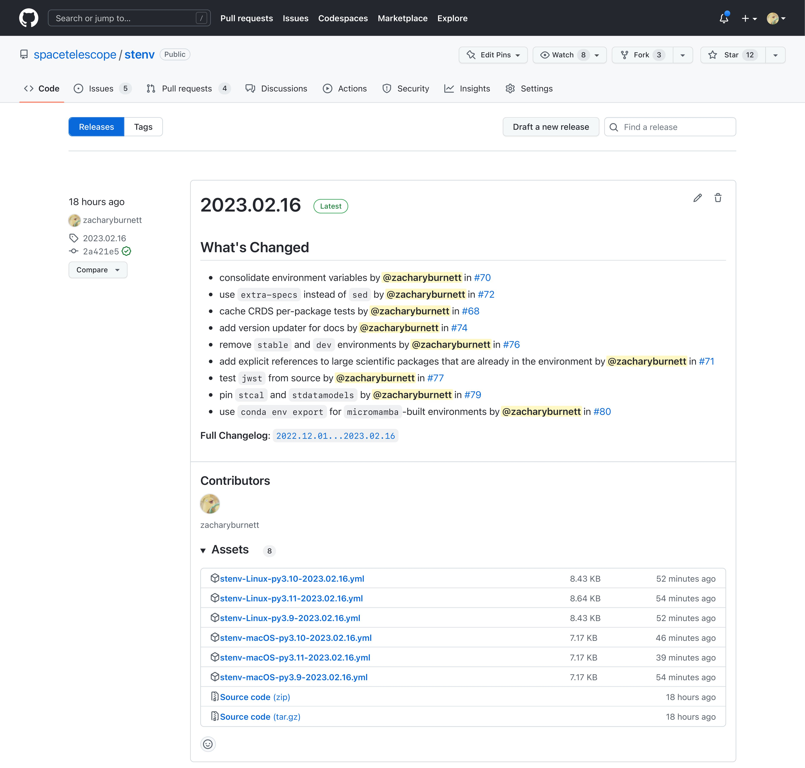

Developer Notes
###############

``stenv`` consists of several parts:

#. a (mostly) unconstrained Conda environment definition file (``environment.yml``)
#. a GitHub Actions CI workflow that automatically builds and tests the environment on several platforms
#. GitHub releases with constrained Conda environment definition files for every tested platform

.. _environment_definition:

Environment Definition
======================

The main environment is defined by ``environment.yml``, which provides packages for building a working environment locally:

.. literalinclude:: ../../environment.yml
   :language: yaml

Automated Build and Testing
===========================

The GitHub Actions `workflow <https://github.com/spacetelescope/stenv/actions/workflows/build.yml>`_ builds and tests the environment on Linux and Mac OS (using GitHub Actions' ``ubuntu-latest`` and ``macos-latest``).

Releases
========

The environment definition files built by the above workflow are attached to `every new release <https://github.com/spacetelescope/stenv/releases>`_.

