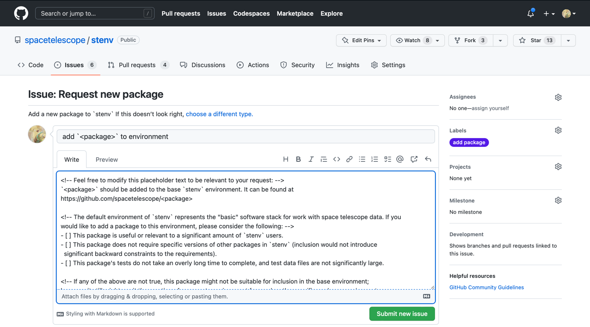

Developer Notes
###############

``stenv`` consists of several parts:

#. an unpinned Conda environment definition YAML file :ref:`environment_yaml`
#. a `GitHub Actions CI workflow <https://github.com/spacetelescope/stenv/actions/workflows/build.yaml>`_ that automatically builds and tests the environment on several platforms
#. `regular GitHub releases <https://github.com/spacetelescope/stenv/releases>`_ with attached constrained Conda environment definition YAML files for every tested platform

.. _environment_yaml:

``environment.yaml``
====================

.. literalinclude:: ../../environment.yaml
   :language: yaml

To build an environment from this unpinned environment definition, run the following:

.. tab:: micromamba

    .. code-block:: shell

        curl -L https://raw.githubusercontent.com/spacetelescope/stenv/main/environment.yaml -o ~/Downloads/stenv.yaml
        micromamba env create --name stenv --file ~/Downloads/stenv.yaml

.. tab:: mamba

    .. code-block:: shell

        mamba env create --name stenv --file https://raw.githubusercontent.com/spacetelescope/stenv/main/environment.yaml 

.. tab:: conda

    .. code-block:: shell

        conda env create --name stenv --file https://raw.githubusercontent.com/spacetelescope/stenv/main/environment.yaml 

.. _adding_a_package_to_stenv:

Adding a package to ``stenv``
=============================

To request that a new package be added to ``stenv``, please `create a new issue in the repository <https://github.com/spacetelescope/stenv/issues/new?assignees=&labels=add+package&template=package_addition_request.md&title=add+%60%3Cpackage%3E%60+to+environment>`_.

