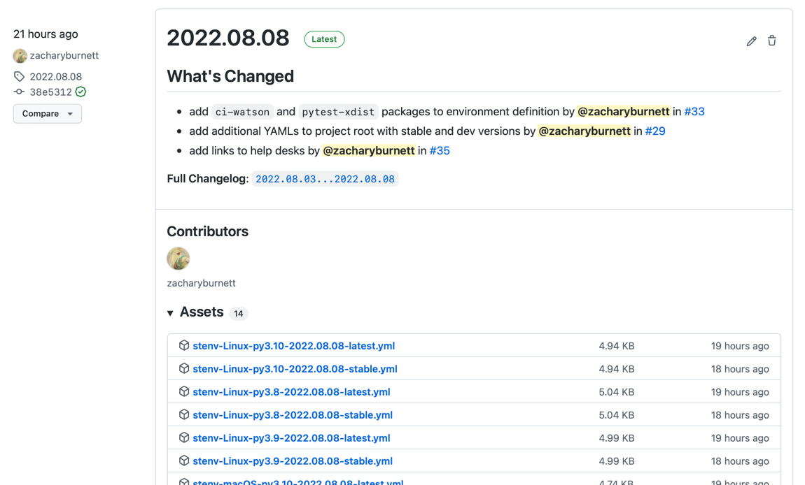

Getting Started
###############

Conda Basics
============

``stenv`` defines a Conda environment, a set of packages installed together at specific versions.
A Conda environment is designed to be isolated from system packages, and can be **activated** (similar to using ``source``) to switch the current context (PATH, environment variables, available binaries, Python installation, etc.) to an isolated instance that is separate from the system.
This has the advantage of allowing several separate installations of Python packages and other tools without cluttering the system installation, allowing switching between use cases or package contexts at will.
A Conda client, such as Miniconda, Mamba, or Anaconda, provides the ``conda`` command, which lets you create, manage, and activate new environments.

Installation
============

.. _install_conda:

Install Conda
-------------

First, choose and install a Conda client and a base Conda environment on your system:

- `Miniconda <https://docs.conda.io/en/latest/miniconda.html>`_ (**recommended**) provides a bare-minimum Conda environment with Python 3.
- `Mamba <https://mamba.readthedocs.io/en/latest/installation.html>`_ is similar to Miniconda but rewritten in C++. It has near-parity of ``conda`` commands with Miniconda and Anaconda.
- `Anaconda <https://www.anaconda.com/distribution/>`_ is Continuum Analytics Inc.'s flagship product, and provides a full-featured Conda root environment as well as hundreds of useful tools, libraries, and utilities by default (OS X users should choose the command-line installer).

.. _choose_release:

Choose an ``stenv`` release
---------------------------

Now that you have a Conda installation, you should choose a release of ``stenv`` from the
`Releases page <https://github.com/spacetelescope/stenv/releases>`_ and download the environment definition file
from the ``Assets`` section that corresponds with your platform.

.. note::
    You can directly download a release file with ``curl``:

    .. code-block:: shell

        curl -L https://github.com/spacetelescope/stenv/releases/download/2023.02.16/stenv-macOS-py3.9-2023.02.16.yml -o stenv-macOS-py3.9-2023.02.16.yml

.. warning::
    Building and testing environments on supported platforms may take several minutes; **if a release was just made recently, you may need to wait** for its `associated workflow job to finish <https://github.com/spacetelescope/stenv/actions/workflows/build.yml>`_ before environment files are available.

Build environment
-----------------

With an environment definition YAML file, you can build the environment with ``conda env create --file <filename> --name <environment-name>`` (the ``--name`` argument is the name of the environment that you create).

.. code-block:: shell

    conda env create --file stenv-macOS-py3.9-2023.02.16.yml --name stenv

This example assumes that you chose an environment file for Mac OSX (``macOS``) with Python 3.9 (``py3.9``) and release ``2023.02.16``.

.. note::
    Instead of downloading a YAML file, you can also pass the url directly to the ``--file`` argument of ``conda env create``:

    .. code-block:: shell

        conda env create --file https://github.com/spacetelescope/stenv/releases/download/2023.02.16/stenv-macOS-py3.9-2023.02.16.yml --name stenv-py3.9-2023.02.16

Activating an environment
=========================

Once you have built an environment, you can activate it with ``conda activate <name>``.
This will temporarily change your PATH, environment variables, available binaries, and Python installation:

.. code-block:: shell

    conda activate stenv

You can now see that ``python`` points to a different installation:

.. code-block:: shell

    which python

.. code-block:: shell

    python
    >>> import jwst

.. note::
    You can show installed packages available within a Conda environment with ``conda env export``.

To deactivate an environment, run ``conda deactivate``.

.. code-block:: shell

    conda deactivate

Deleting an environment
=======================

To delete an environment with all of its packages, run ``conda env remove -n <name>``:

.. code-block:: shell

    conda env remove -n stenv