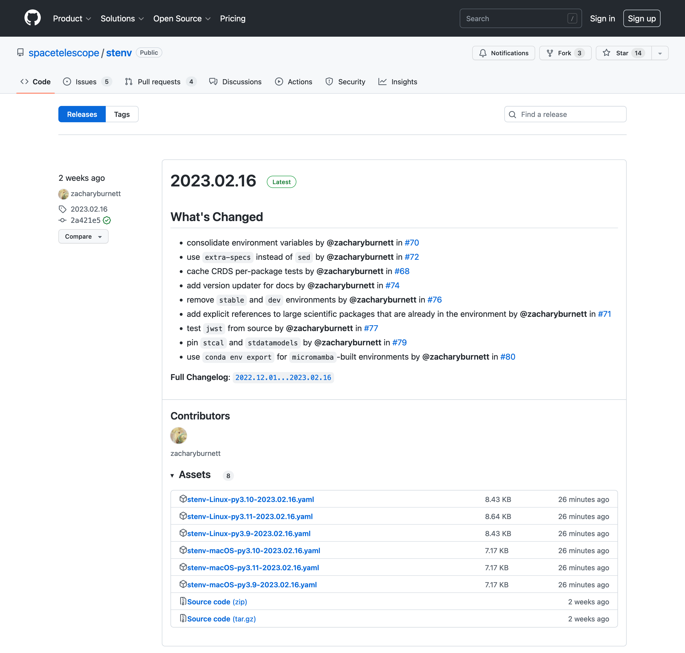

Getting Started
###############

Conda Basics
============

``stenv`` defines a Conda environment, which is a set of packages installed together at specific versions.
A Conda environment is designed to be isolated from system packages, and can be **activated** to switch the current context (PATH, environment variables, available binaries, Python installation, etc.) to an isolated instance that is separate from the system.
(This is similar to using ``source bin/activate``, if you are familiar with Python ``virtualenv``).
This has the advantage of allowing several separate installations of Python packages and other tools without cluttering the system installation, allowing switching between use cases or package contexts at will.

Installation
============

.. _install_conda:

Install Conda
-------------

A Conda distribution provides the ``micromamba`` / ``mamba`` / ``conda`` command, which lets you create, manage, and switch to (activate) environments.
Try running ``micromamba``, ``mamba``, or ``conda`` in your terminal.
If you get ``command not found`` (or similar), see below to install. 

.. tab:: micromamba

    Run the following in your terminal to install ``micromamba``:

    .. code-block:: shell

        "${SHELL}" <(curl -L micro.mamba.pm/install.sh)

    Alternatively, macOS users can use the `Homebrew package manager <https://brew.sh/>`_:

    .. code-block:: shell

        brew install micromamba
        micromamba shell init

.. tab:: mamba

    Follow `these instructions to install Miniforge <https://github.com/conda-forge/miniforge/blob/main/README.md>`_, 
    which includes the ``mamba`` command in its base environment.

    .. important::
        Remember to run ``mamba init`` after installing.
        You need to do this before attempting to ``activate`` / ``deactivate`` environments.

        .. code-block:: shell

            mamba init

.. tab:: conda

    .. caution::
        The Anaconda organization has `updated their terms of service <https://legal.anaconda.com/policies/en/#:~:text=2.1%20Organizational%20Use.%C2%A0>`_
        to indicate that any usage of their services requires a paid license, if used by an organization of more than 200 users. This includes pulling packages from the Anaconda ``defaults`` channels, as well as installing ``conda`` itself.

        ``mamba`` is the recommended drop-in replacement for ``conda``. 
        We recommend that you use ``mamba`` and pull packages from the ``conda-forge`` channel, instead of using ``conda`` and the ``defaults`` channels.

    Follow `these instructions to install Miniforge <https://github.com/conda-forge/miniforge/blob/main/README.md>`_, 
    which includes the ``conda`` command in its base environment.

    .. important::
        Remember to run ``conda init`` after installing.
        You need to do this before attempting to ``activate`` / ``deactivate`` environments.

        .. code-block:: shell

            conda init

.. _choose_release:

Choose an ``stenv`` release
---------------------------

Now that you have a Conda installation, you should choose a release of ``stenv`` from the
`Releases page <https://github.com/spacetelescope/stenv/releases>`_
and choose the environment definition file from the ``Assets`` section that corresponds with your platform.

Every release is available for several combinations of operating system and Python version. 
The name of the release file indicates which is which.
For example, a release of stenv for Python ``3.11`` on Linux will be named something like ``stenv-Linux-X64-py3.11-YYYY.MM.DD.yaml`` (where ``YYYY.MM.DD`` is the date of the release).
Unless you have particular requirements, you should choose the 
newest (highest-numbered) Python version available. 

.. note::
    Version numbers aren't real numbers; a hypothetical Python ``3.20`` would be newer than Python ``3.2``.

.. warning::
    **Can't find the release you need?** Building and testing environments on supported platforms may take several minutes; for new releases, you may need to wait for the 
    `associated workflow job <https://github.com/spacetelescope/stenv/actions/workflows/build.yaml>`_
    to finish before environment files are available.

.. note::
    Every Conda environment has a name, specified by the ``--name`` or ``-n`` option.
    Include the version numbers in the name to make it easier to keep track of which version of ``stenv`` you have;
    for example, ``stenv-py3.11-2023.01.01``.

Download the file corresponding to your platform and desired Python version, then run the following command in a terminal using the file you downloaded (in this example ``stenv-Linux-py3.10-2023.02.16.yaml``):

.. tab:: micromamba

    .. code-block:: shell

        micromamba env create --name stenv --file ~/Downloads/stenv-Linux-py3.10-2023.02.16.yaml --use-uv

.. tab:: mamba

    .. code-block:: shell

        mamba env create --name stenv --file ~/Downloads/stenv-Linux-py3.10-2023.02.16.yaml --use-uv

.. tab:: conda

    .. code-block:: shell

        conda env create --name stenv --file ~/Downloads/stenv-Linux-py3.10-2023.02.16.yaml

    .. note::
        If you run into issues with building an environment with ``conda`` from a local file, you can also try using the direct URL that you chose above.

.. note::
    If the build does not succeed on your system, please refer to :ref:`build_fails`

Activating an environment
=========================

Environments let you install packages while isolating them from the rest of your system, and even each other.
Even though we just created an environment, we will not be able to import the new packages yet:

.. code-block:: shell

    $ python -c 'import jwst; print("ok")'
    Traceback (most recent call last):
      File "<string>", line 1, in <module>
    ModuleNotFoundError: No module named 'jwst'

In order to access the packages in ``stenv``, you must first ``activate`` the environment you just created: 

.. important::
    If you chose another name when creating the environment, use that here instead.

.. tab:: micromamba

    .. code-block:: shell

        micromamba activate stenv

.. tab:: mamba

    .. code-block:: shell

        mamba activate stenv

.. tab:: conda

    .. code-block:: shell

        conda activate stenv

Activating a Conda environment changes which Python interpreter and packages are in use for that session (i.e. terminal window).
Now, if you try to ``import jwst``:

.. code-block:: shell

    (stenv) $ python -c 'import jwst; print("ok")'
    ok

Every time you open a new terminal window, you will need to activate the environment before you can use software included in ``stenv``.

.. note::
    You can show installed packages available within a Conda environment with ``conda list``:

    .. tab:: micromamba

        .. code-block:: shell

            micromamba list

    .. tab:: mamba

        .. code-block:: shell

            mamba list

    .. tab:: conda

        .. code-block:: shell

            conda list

To ``deactivate`` an environment and return your shell to normal, close your terminal window or run ``conda deactivate``:

.. tab:: micromamba

    .. code-block:: shell

        micromamba deactivate

.. tab:: mamba

    .. code-block:: shell

        mamba deactivate

.. tab:: conda

    .. code-block:: shell

        conda deactivate

Deleting an environment
=======================

To delete an environment with all of its packages, run ``conda env remove --name <name>``:

.. important::
    If you chose another name when creating the environment, use that here instead.

.. tab:: micromamba

    .. code-block:: shell

        micromamba env remove --name stenv

.. tab:: mamba

    .. code-block:: shell

        mamba env remove --name stenv

.. tab:: conda

    .. code-block:: shell

        conda env remove --name stenv

