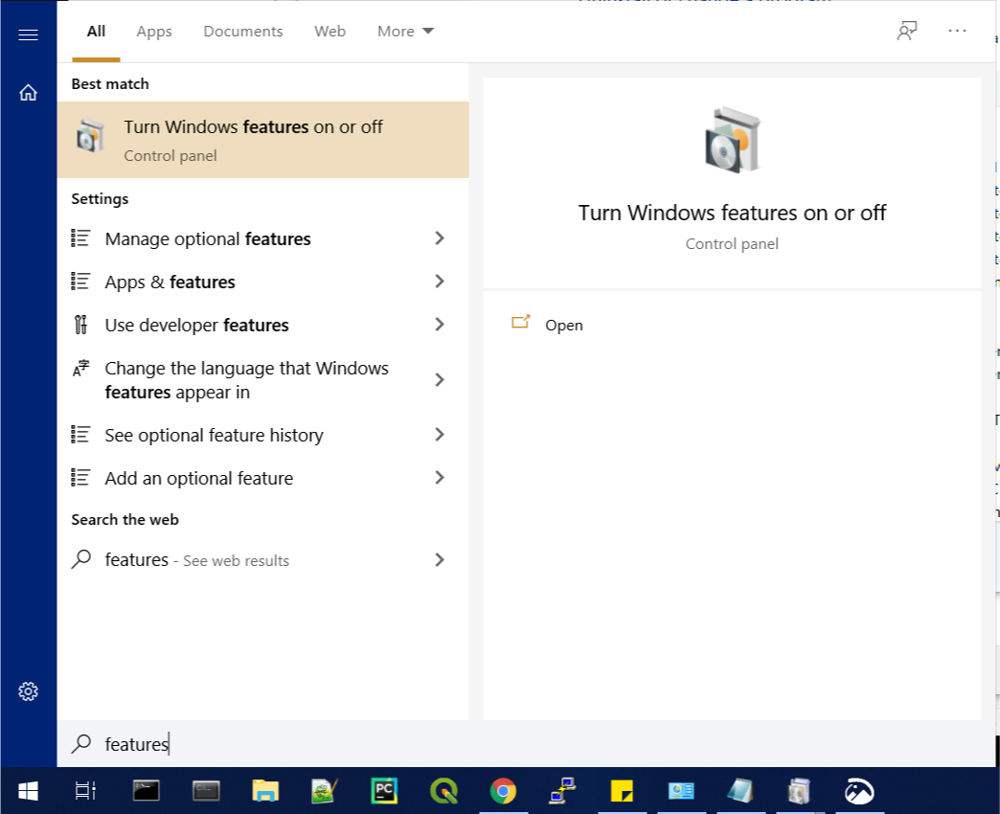
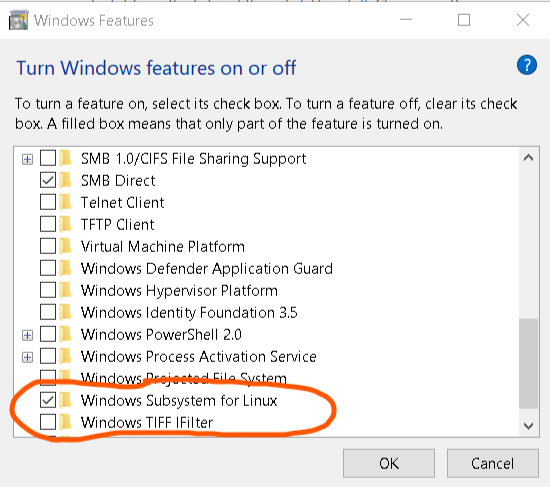

Windows Support
###############

``stenv`` does not currently support Windows, as
``hstcal``, ``fitsverify``, and the ``jwst`` calibration pipeline are not built or tested on Windows platforms. 

If you would like to run ``stenv`` on Windows, you can use the :ref:`wsl`, 
an optional Windows feature that provides a functioning Linux terminal with access to the host operating system.
	
.. _wsl:

Windows Subsystem for Linux (WSL)
=================================

Installation
------------

Windows Subsystem for Linux (WSL) is a platform provided by Microsoft onto which a Linux distribution (i.e. Ubuntu) can be installed. 
It provides a Linux shell within Windows that contains a functional Linux operating system, and thus can compile and run programs meant for Linux within that environment.

1. Enable ``Windows Subsystem for Linux`` in Windows Features
^^^^^^^^^^^^^^^^^^^^^^^^^^^^^^^^^^^^^^^^^^^^^^^^^^^^^^^^^^^^^

Search ``Features`` in the Windows Start menu, and click on ``Turn Windows features on or off`` 
(alternatively, this can be found in ``Programs and Features`` of the Control Panel).

.. note::
	**This is the only step that requires administrator privileges.**

In ``Windows Features``, scroll down to ``Windows Subsystem for Linux`` and check it, then click ``OK``

Reboot when prompted.

2. Download your choice of Linux distribution as an app package
^^^^^^^^^^^^^^^^^^^^^^^^^^^^^^^^^^^^^^^^^^^^^^^^^^^^^^^^^^^^^^^

The easiest way to download a Linux distribution for WSL is via the Microsoft Store:

.. image:: https://developer.microsoft.com/store/badges/images/English_get-it-from-MS.png
	:alt: Microsoft Store link to Ubuntu WSL
	:target: http://www.microsoft.com/store/apps/9nblggh4msv6?cid=storebadge&ocid=badge
	:width: 25%

If you do **not** have access to the Microsoft Store, download the latest Ubuntu distribution from 
`Microsoft's WSL distribution page <https://docs.microsoft.com/en-us/windows/wsl/install-manual>`_
and then run the following command in PowerShell to register the app package:

.. code-block:: powershell

	Add-AppxPackage ~\Downloads\Ubuntu_2004.2020.424.0_x64.appx

3. Open WSL and start Linux
^^^^^^^^^^^^^^^^^^^^^^^^^^^

Now, type ``Ubuntu`` into the Start Menu and run it:

.. image:: ./images/start_menu_ubuntu.png
	:alt: the Windows Start menu with ``Ubuntu`` in the search box; the top result is ``Ubuntu 20.04 LTS``

This will boot the operating system and start the installation within WSL, after which it will prompt you for a username and password.

.. image:: ./images/wsl_terminal.png
	:alt: terminal window showing a Bash shell

After installation completes, you now have a functional Linux operating system.

You have access to many Windows utilities from within the Linux shell, and many WSL utilities from the Windows shell.
By default, the Windows partition is mounted at ``/mnt/c``.

Microsoft provides `documentation on interoperability between Windows and WSL <https://docs.microsoft.com/en-us/windows/wsl/interop>`_.
