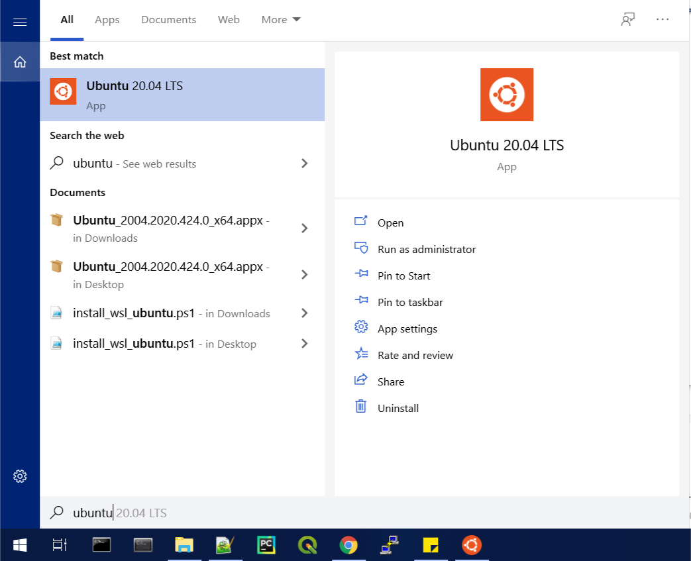
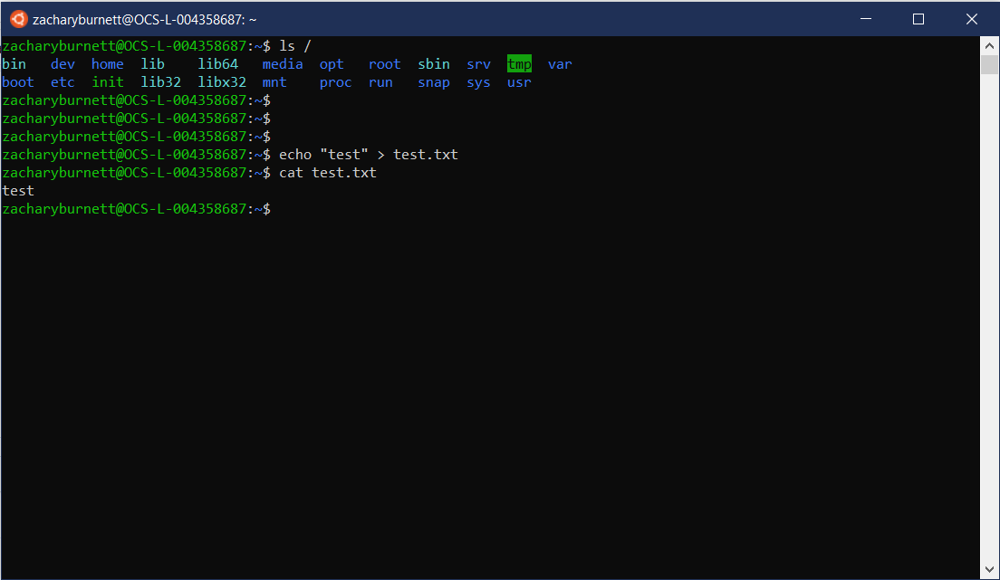

Windows Support
###############

``stenv`` does not currently support Windows, as
``hstcal``, ``fitsverify``, and the ``jwst`` calibration pipeline are not built or tested on Windows platforms. 

If you would like to run ``stenv`` on Windows, you can use the :ref:`wsl`, 
an optional Windows feature that provides a functioning Linux terminal with access to the host operating system.

After installing your Linux system, install ``stenv`` by following the :doc:`getting_started` instructions.

.. _wsl:

Windows Subsystem for Linux (WSL)
=================================

Windows Subsystem for Linux (WSL) is a platform provided by Microsoft onto which a Linux distribution (i.e. Ubuntu) can be installed. 
It provides a Linux shell within Windows that contains a functional Linux operating system, and thus can compile and run programs meant for Linux within that environment.

To install WSL on your machine, follow `Microsoft's provided installation instructions <https://learn.microsoft.com/en-us/windows/wsl/install>`_:

.. code-block:: powershell

	wsl --install

Now, type ``Ubuntu`` (or whatever other distribution you chose) into the Start Menu:

This will boot the operating system and start the installation within WSL, after which it will prompt you to set a username and password.

After installation completes, you now have a functional Linux operating system that you can access in the same way.

You have access to many Windows utilities from within the Linux shell, and many WSL utilities from the Windows shell.
By default, the Windows partition is mounted at ``/mnt/c``.

Microsoft provides `documentation on interoperability between Windows and WSL <https://docs.microsoft.com/en-us/windows/wsl/interop>`_.

